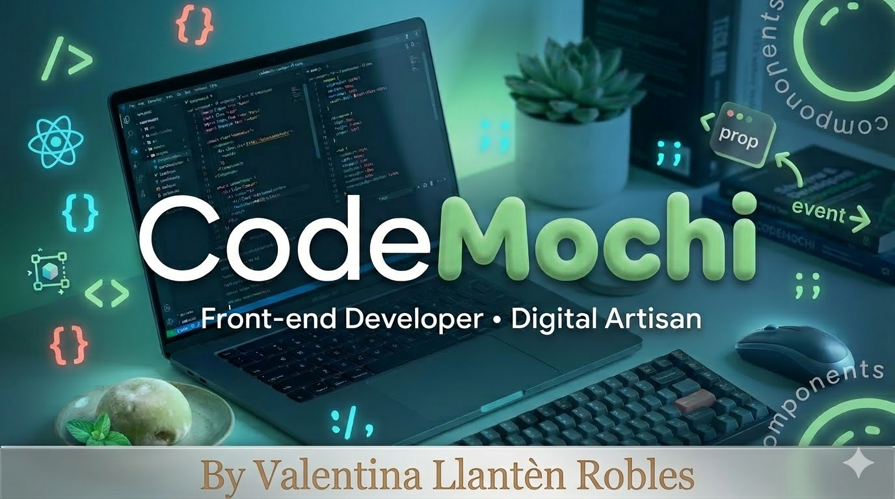
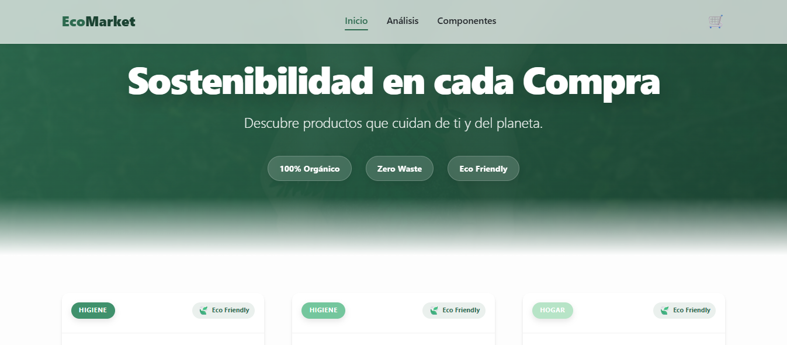
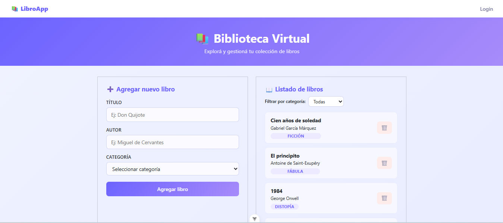
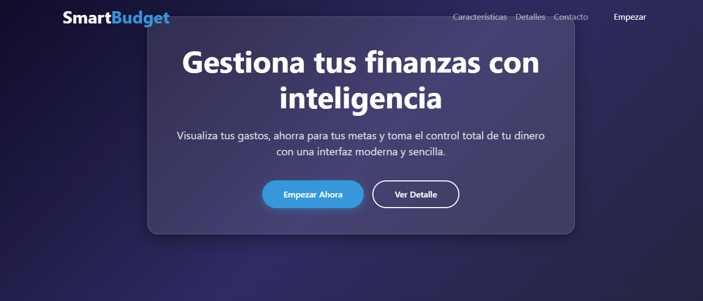
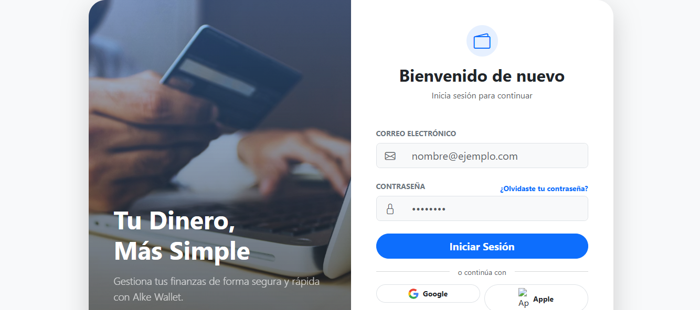

<div align="center">



</div>

<div align="center">


</div>

---

<div align="center">

### 🚀 Valentina Llantén — Frontend Developer

💡 *Transformo ideas en productos digitales rápidos, escalables y visualmente atractivos.*

📍 Santiago, Chile

<br/>

[](https://www.linkedin.com/in/valentina-llant%C3%A9n-robles-a2684a276/)
[](https://portafolio-pro-virid.vercel.app/)
[](mailto:valentinapazll.r@gmail.com)

</div>

---

## 🧠 Sobre mí

| | |
|---|---|
| ✨ | Desarrolladora enfocada en **Frontend con Vue.js** |
| 🎯 | Apasionada por **UX, performance y diseño moderno** |
| 🚀 | Evolucionando hacia **Full Stack con Java** |
| 🌱 | Siempre aprendiendo y construyendo cosas nuevas |

---

## 🛠️ Tech Stack

<div align="center">

**Frontend**


**Backend & DB**


**Herramientas**


</div>

---

## 🚀 Proyectos Destacados

<div align="center">

---

### 🛒 EcoMarket



> SPA con Vue 3 · UI moderna · Estado reactivo con Pinia

[](https://valentinapazllr-ops.github.io/analisis-de-caso-Ecomarket/)
[](https://github.com/valentinapazllr-ops/analisis-de-caso-Ecomarket)

---

### 📚 LibroApp



> CRUD completo · Firebase Realtime Database · Autenticación

> 🔐 Demo: `usuario@email.com` / `123456`

[](https://m6-abp.vercel.app/login)
[](https://github.com/valentinapazllr-ops/M6-ABP)

---

### 💰 SmartBudget



> Gestión financiera personal · UI clara · UX enfocada en usabilidad

[](https://valentinapazllr-ops.github.io/Proyecto-ABP-M3/)
[](https://github.com/valentinapazllr-ops/Proyecto-ABP-M3)

---

### 💳 Alkemi Wallet



> Fintech app · Login + flujo de usuario completo · Diseño moderno

> 🔐 Demo: `usuario@email.com` / `123456`

[](https://valentinapazllr-ops.github.io/alke-wallet1-deployment/)
[](https://github.com/valentinapazllr-ops/alke-wallet1)

</div>

---

## 📊 GitHub Stats

<div align="center">


<br/>


</div>

---

## ⚡ En este momento estoy...

```text
🌱 Aprendiendo    Java Full Stack (Spring Boot)
🧠 Explorando     Arquitectura Frontend avanzada
🚀 Mejorando      Performance & Core Web Vitals
🤝 Buscando       Oportunidades como desarrolladora
` ` `
